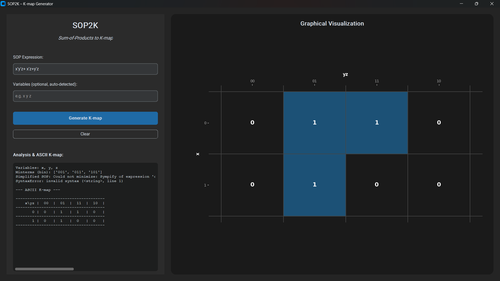

# SOP2K – Sum-of-Products to K-map Generator



**SOP2K** is a sleek, modern desktop application designed to streamline digital logic design. It converts boolean Sum-of-Products (SOP) expressions into textbook-quality Karnaugh Maps (K-maps) with real-time visualization and automatic boolean minimization.

## Features

-   **Modern Dark UI**: A professional, high-contrast interface built with `customtkinter`.
-   **Intelligent Parsing**: Supports 3–6 variable expressions with automatic variable name detection.
-   **Boolean Minimization**: Powered by `SymPy`, it automatically simplifies your input into the most efficient logical form.
-   **Dynamic K-Map Rendering**: Real-time graphical visualization using `Matplotlib`, featuring Gray-code axis labeling and highlighted cells.
-   **Textbook-Style ASCII**: Formatted terminal output with grid lines and variable labels for documentation.

---

## Getting Started

### Installation

1.  **Clone or Download** this repository.
2.  **Activate your virtual environment** (recommended):
    ```bash
    .\.venv\Scripts\activate
    ```
3.  **Install dependencies**:
    ```bash
    pip install -r requirements.txt
    ```

### Running the App

Launch the generator with:
```bash
python sop2k.py
```

---

## Usage Tips

-   **Negation**: Use a single quote `'` for NOT (e.g., `A'` or `x'`).
-   **AND**: Simply concatenate variables (e.g., `ABC`) or put spaces between them.
-   **OR**: Use the `+` symbol (e.g., `xy + yz'`).
-   **Variables**: If not specified, variables are auto-detected alphabetically from your expression.

### Example Inputs
-   `xy + x'y'z`
-   `AB + A'B'CD`
-   `ABC + DE + A'B'C'D'E'`

---

## Development & Testing

Run the automated test suite to verify the parser and logic modules:
```bash
python -m pytest tests/test_utils.py
```

---

## License
MIT License - Feel free to use and improve!
